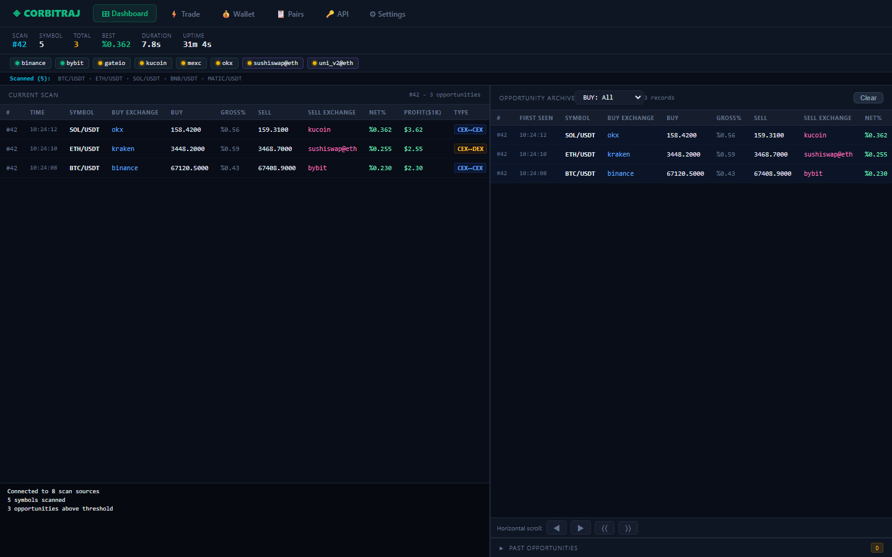
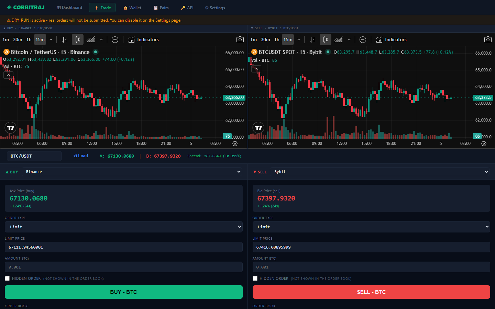
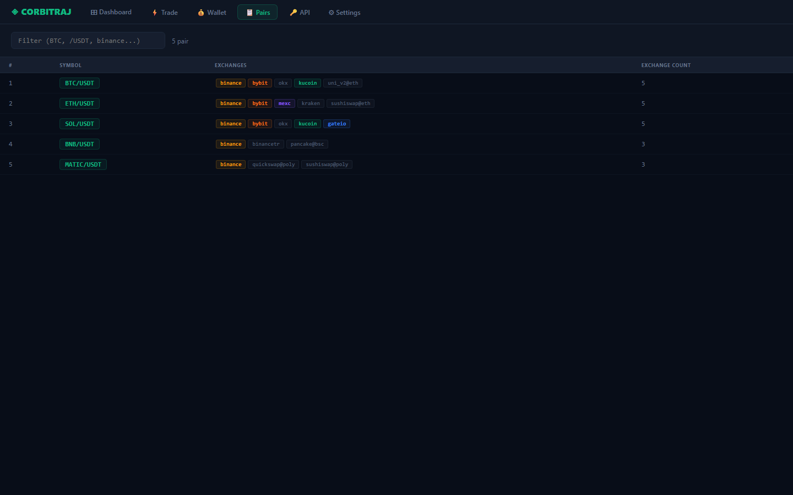
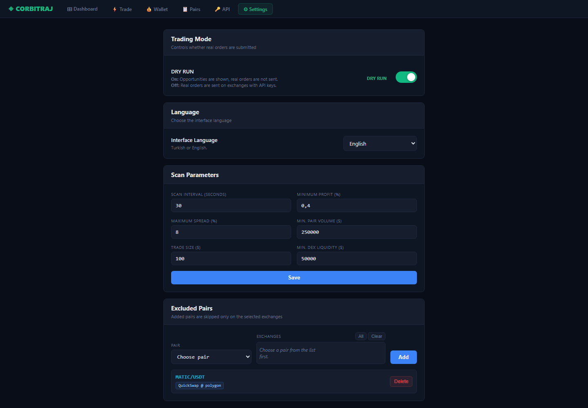

# Corbitraj

Corbitraj is a local crypto arbitrage scanner and trading dashboard. It scans
centralized exchanges and configured DEX pools, shows potential spreads, keeps
an opportunity archive, and provides local trading/order-book screens for
supported exchanges.

The project is designed to be public-safe when committed with the included
`.gitignore`. Real API keys must stay in local-only files.

## Features

- Multi-exchange CEX price scanning through direct HTTP/CCXT integrations
- DEX pool checks with liquidity and freshness filters
- Opportunity dashboard with archive and exchange filters
- Trade screen with charts, order book, balances, and open orders
- Excluded-pair settings per exchange
- Turkish and English UI, with English as the default
- `DRY_RUN=True` by default to prevent accidental real orders

## Screenshots

Screenshots use demo data only; no credentials or private balances are shown.

| Dashboard | Trade screen |
| --- | --- |
|  |  |

| Scanned pairs | Settings |
| --- | --- |
|  |  |

## Requirements

- Python 3.11+
- Windows, macOS, or Linux
- Exchange API keys only if you want balances or real order placement

Install dependencies:

```powershell
python -m venv .venv
.\.venv\Scripts\Activate.ps1
pip install -r requirements.txt
```

On macOS/Linux:

```bash
python3 -m venv .venv
source .venv/bin/activate
pip install -r requirements.txt
```

## Configuration

Copy the example environment file and fill only the exchanges you use:

```powershell
Copy-Item .env.example .env.local
```

Important defaults in `config.py`:

- `DRY_RUN = True`: opportunities are shown, real orders are not sent.
- `LANGUAGE = "en"`: English is the default UI and terminal language.
- `HOST = "127.0.0.1"`: the web server binds to localhost by default.
- `PORT = 8001`: default local port.

Do not commit `.env`, `.env.local`, `api.local.txt`, cache files, or personal
notes containing credentials.

## Run

```powershell
python server.py
```

Open:

```text
http://127.0.0.1:8001
```

Main pages:

- `/` dashboard
- `/trade` trade screen
- `/pairs` scanned pair list
- `/wallet` balances
- `/api-keys` local API key helper
- `/settings` runtime settings

## Run In GitHub Codespaces

You can run the project without installing Python locally by using GitHub
Codespaces:

1. Open the repository on GitHub.
2. Click `Code` -> `Codespaces` -> `Create codespace on main`.
3. Wait for the container setup to finish. Dependencies are installed
   automatically from `requirements.txt`.
4. Run:

```bash
python server.py
```

Codespaces will forward port `8001` and open the dashboard in the browser.
The devcontainer copies `.env.example` to `.env.local` automatically; fill real
API keys only if you need private exchange data or order placement.

## Local API Key Helper

The `/api/save-env` endpoint writes submitted API keys into `.env` and updates
the in-memory exchange client. It is intended only for local development and is
restricted to localhost requests in `server.py`.

For a public deployment, remove or disable this endpoint and use a dedicated
secret manager instead.

## Safety Notes

- Keep `DRY_RUN=True` unless you explicitly want real orders.
- Use exchange API keys with the minimum required permissions.
- Prefer read-only keys unless testing order placement.
- Restrict exchange keys by IP where possible.
- Never commit real credentials or private RPC URLs.

## Pre-Push Checks

Run syntax checks:

```powershell
python -m py_compile config.py server.py bot.py cex.py dex.py coingecko.py coin_identity.py
```

Check that ignored local files are not staged:

```powershell
git status --short
```

Optional secret scan:

```powershell
rg -n --hidden --glob '!.git/**' --glob '!*.example*' "(API_KEY|SECRET|PASSPHRASE|PRIVATE_KEY|TOKEN|Bearer |sk-|AKIA|0x[a-fA-F0-9]{64})" .
```

## License

MIT License. See [LICENSE](LICENSE).
